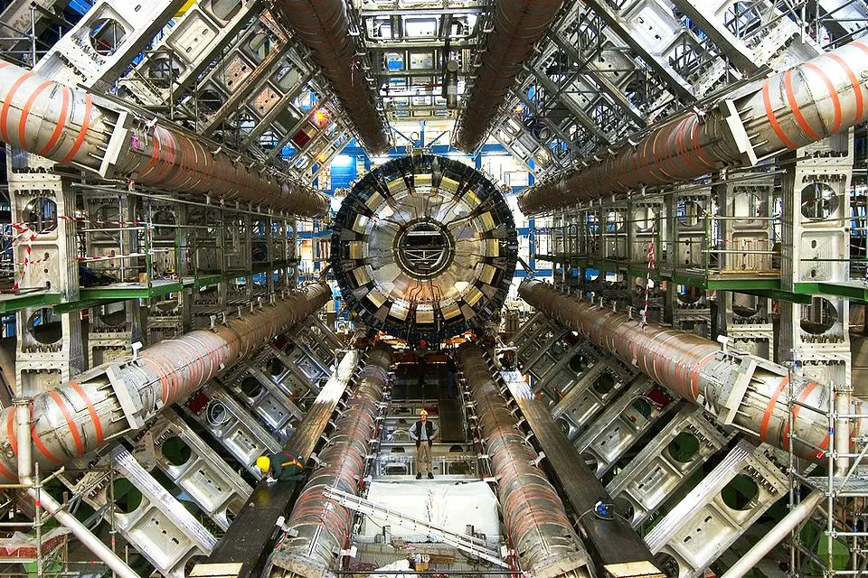

# Experimental Methods in Particle Physics - 114250

### Course Info

___

Modern particle physics advancements are dominated by large collaborative experiments such as those at CERN, where cutting-edge particle detection technologies allow us to peer into the fabric of our universe deeper than ever before. In this course we will explore a variety of these technologies, such as cloud chambers and scintillators, with which we achieved significant progress in our understanding of particle physics in the past and even today. We will explore the physical mechanisms behind particle detection, and attempt to build a selection of small-scale particle detectors with the aim of deepening our understanding of particle physics and hopefully even performing basic data acquisition and analysis.

### Logistics

___

**Course Number:** 114250

**Credit Points:** 3

**Language of Instruction:** English

**Lecture Meetings:** Thursdays, 11:30am to 12:30pm, Lidow 709

**Lab Meetings:** Tuesdays, 12:30pm to 15:30pm, Lidow 103

### Schedule

___

| Week  | Date (Week of) | Plan |
| :---: | :---: | :---: |
| 1 | 24/3 | No Meeting ✔ |
| 2 | 31/3 | Introduction to Particle Physics ✔ |
| 3 | 7/4 | Cloud Chambers I ✔ |
| 4 | 14/4 | Cloud Chambers II ✔ |
| 5 | 21/4 | No Meeting (Passover) ✔ |
| 6 | 28/4 | No Meeting ✔ |
| 7 | 5/5 | No Meeting ✔ |
| 8 | 12/5 | Cloud Chambers III ✔ |
| 9 | 19/5 | Photon Detectors & Mechatronics ✔ |
| 10 | 26/5 | Scintillators I ✔ |
| 11 | 2/6 | Scintillators II / Cloud Chambers IV |
| 12 | 9/6 | Trigger Systems I |
| 13 | 16/6 | Trigger Systems II |
| 14 | 23/6 | Cosmic Hodoscopes I |
| 15 | 30/6 | Cosmic Hodoscopes II |

### Course Staff

___

| Staff Member | Office | Email | Office Hours |
| :---: | :---: | :---: | :---: |
| Lecturer - Prof. Enrique Kajomovitz | Lidow 709 | enrique@physics.technion.ac.il | By appt. |
| TA - Yotam Granov | Lidow 232 | yotam.g@campus.technion.ac.il | By appt. |

